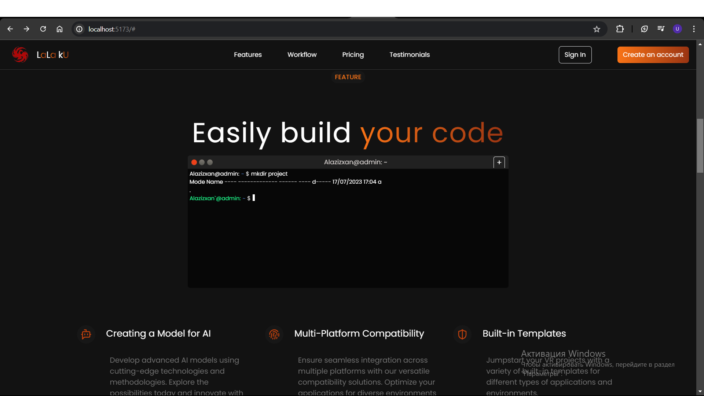
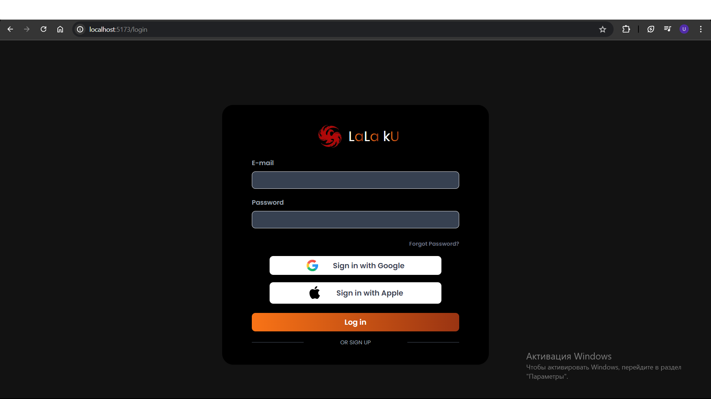
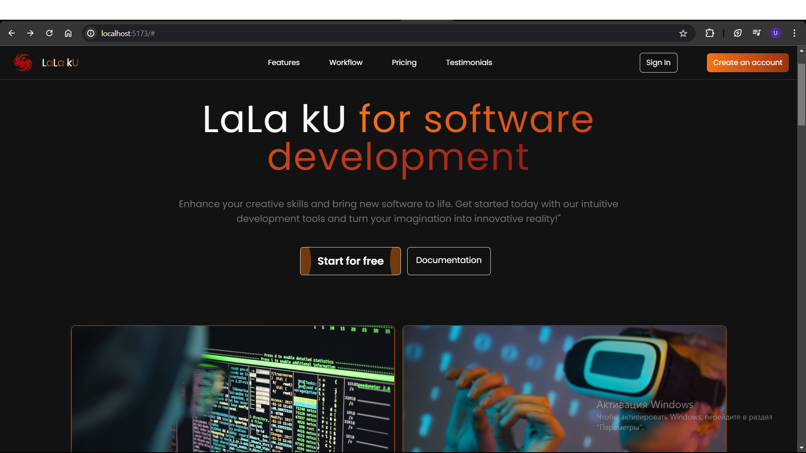

# Front End Project with Node.js + React and Vite

## Overview

This project is a front-end application built using Node.js and Vite. It includes beautifully designed login and register pages. The application focuses on providing a seamless user experience with a modern interface.





## Features

- **Login Page**: Secure and user-friendly login page with validation.
- **Register Page**: Easy-to-use registration page with form validation.
- **Responsive Design**: Optimized for both desktop and mobile devices.
- **Pricing card**
- **Terminal design**


## Technologies Used

- **Node.js**: Server-side JavaScript runtime.
- **Vite**: Next generation frontend tooling.
- **React**







## Getting Started

Follow these instructions to get a copy of the project up and running on your local machine for development and testing purposes.

### Prerequisites

Make sure you have Node.js installed on your system.

```sh
node -v
```

## Installation

**1. Clone the repository**

```sh
git clone https://github.com/Alazizxan/LaLa-kU.git
cd LaLa-kU
```

**2.Install**

```sh
npm install
```

**Start the development server:**

```sh
npm run dev
```